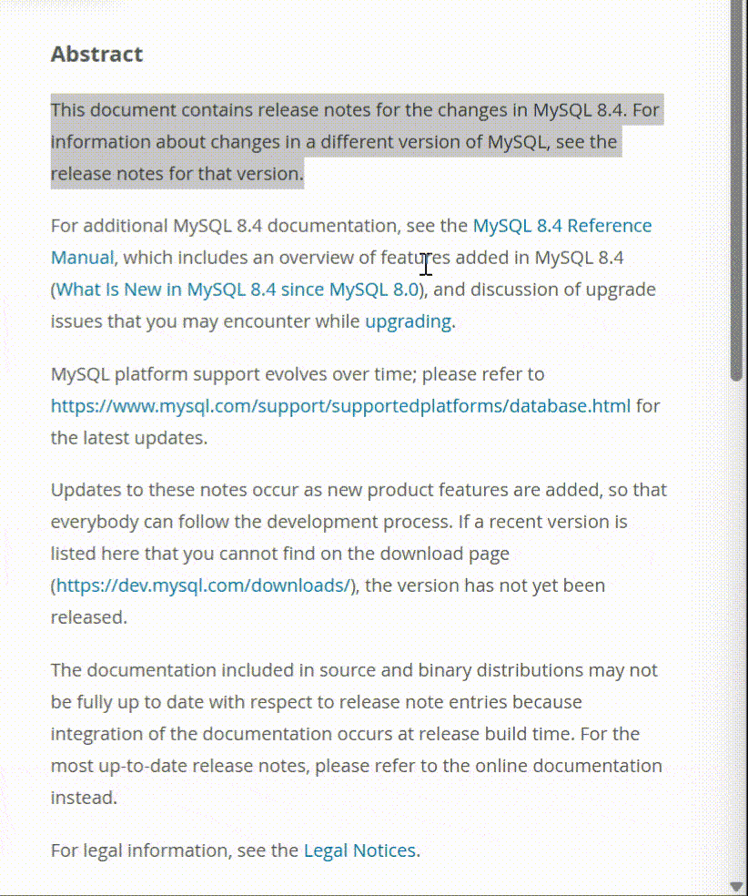
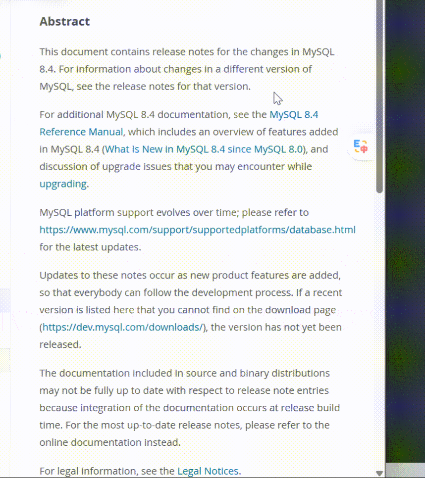

# Shizi - Open-source Windows Translator

[](LICENSE)
[](https://tauri.app/)
[](https://www.rust-lang.org/)
[](https://vuejs.org/)
[](https://www.typescriptlang.org/)
[](https://www.microsoft.com/windows/)

> An open-source Windows translation app powered by LLMs and OCR, built with Tauri, Rust and Vue.

柿子翻译 是一款开源的 Windows 桌面翻译软件，支持手动输入、划词翻译和截图 OCR 翻译，可接入 OpenAI-compatible、Claude 与 Microsoft Edge 等翻译服务。项目灵感来自 macOS 平台的 [Bob](https://bobtranslate.com/)，基于 Tauri 2、Rust 和 Vue 3 构建。

## 核心功能

<table>
  <tr>
    <td align="center" width="33%" valign="middle">
      <!-- 输入翻译演示 GIF 待补充 -->
    </td>
    <td align="center" width="33%" valign="middle">
      
    </td>
    <td align="center" width="33%" valign="middle">
      
    </td>
  </tr>
  <tr>
    <td align="center"><b>输入翻译</b></td>
    <td align="center"><b>截图翻译</b></td>
    <td align="center"><b>划词翻译</b></td>
  </tr>
  <tr>
    <td align="center"><sub>启动应用 · 手动输入</sub></td>
    <td align="center"><code>Alt+S</code></td>
    <td align="center"><code>Alt+D</code></td>
  </tr>
</table>

### 输入翻译

1. 启动应用，默认显示翻译弹窗。
2. 在输入框输入要翻译的文本。
3. 点击「翻译」。

### 截图翻译

1. 按 `Alt+S`，整屏冻结为 overlay 画面，鼠标变为十字。
2. 拖动选择要识别的矩形区域。
3. 松开鼠标后，Shizi 调用当前启用的 OCR 引擎识别选区文字并自动翻译。

> Esc、右键或选区过小（&lt;3px）会取消本次截图，不进入翻译。Windows OCR 依赖系统语言包，中英混合需安装对应 OCR 语言包。

### 划词翻译

1. 在任意支持复制的应用中选中文本。
2. 按 `Alt+D`。
3. Shizi 会尝试读取选中文本并自动翻译。

> 当前划词复制只尽力保护纯文本剪贴板，不保证完整恢复图片、文件、HTML、RTF 等非文本剪贴板格式。

### 独立文字识别

1. 托盘「文字识别」或默认快捷键 `Alt+O` 打开独立识别窗口。
2. 支持截图框选、打开图片文件、读取剪贴板图片三种输入。
3. 识别结果展示预览图、全文与引擎元信息（耗时、尺寸等）；**不**自动进入翻译、不写翻译历史。
4. 至少一次纯识别成功后，工具栏「重新识别」可用，对**当前源图**再跑一遍 OCR（进程内单槽缓存，失败不清除，不落盘）；无缓存或识别进行中时按钮禁用。

## 更多功能

除上述核心功能外，Shizi 还提供：

- 托盘常驻：关闭窗口会隐藏到托盘，通过托盘菜单退出应用。
- Windows 应用图标：采用柿子成熟色「文 / A」字标，ICO 内置独立 16/20/24 px 光学校正帧，32 px 起显示双向转换箭头；系统托盘按主显示器 DPI 选择 16-48 px 专用 PNG，避免跨尺寸放大导致模糊。
- 可配置快捷键：设置页「全局快捷键」可修改、清空并保存划词翻译、截图 OCR 翻译、文字识别、剪贴板翻译，保存成功后无需重启即可生效；「打开设置」为程序快捷键（仅应用窗口聚焦时生效）；取词翻译本轮仅保存绑定，不注册触发。
- OpenAI-compatible 流式翻译 provider：调用兼容 `/v1/chat/completions` 的流式接口。
- Claude / Anthropic 流式翻译 provider：调用 Anthropic Messages API 的 SSE 流式接口，支持 thinking 模式。
- Mock provider：用于无真实 API Key 的本地验证。
- 微软翻译 provider（Edge 引擎，免 Key 机器翻译）：调用 Edge 浏览器翻译接口，无需 API Key；机器翻译渠道当前仅微软翻译已对接，DeepL/Google/百度等保持开发中（dev 包设置页可见、release 包隐藏入口，config 数据保留）。
- 启动翻译弹窗与独立设置页：启动即显示翻译弹窗；设置页为独立窗口，可从翻译弹窗设置按钮或托盘「设置」打开。设置页含通用 / 翻译 / 快捷键 / 服务 / 历史 / 高级 6 个分类面板，支持多服务实例管理。翻译弹窗已去除 Windows 原生标题栏，改为自绘顶部工具栏（图钉 / 收藏 / 截图翻译 / 书签 / 设置）作为标题栏并支持拖拽，宽固定 420px、高度随内容自适应（最高 80% 屏幕高），视觉对齐 OpenDesign 原型。
- 配置实时同步：设置页保存服务启用 / 关闭后，会通过 `app-config:changed` 通知已打开的翻译弹窗同步结果卡片；非翻译中即时新增、删除、排序，翻译进行中保留正在输出的卡片，不新增未参与当前批次的服务卡片。
- 流式结果展示：Rust 后端通过 Tauri event 推送翻译状态和增量文本，前端实时渲染。
- 结果卡片长内容截断：翻译结果超过约 4-5 行时自动截断，底部渐隐遮罩 + 「展开全文」按钮，点击展开/收起。
- 输入原文限高：输入框超过最大高度（约 7 行）后内部滚动，不再撑高弹窗。
- 翻译取消与重试：流式翻译过程中可取消，失败或取消后可一键重试。
- OCR 错误指引：截图 OCR 失败（缺语言包 / 识别为空 / 区域过大等）时给出带阶段前缀与可操作指引的错误文案，并隐藏无意义的重试按钮。
- Token 用量展示：流式翻译结束时在译文下方显示 input → output token 数；可在设置页关闭采集。
- 翻译来源徽章：划词翻译显示「来自划词」、OCR 翻译显示「来自 OCR」，手动输入不显示；翻译结束/取消/失败/清空时徽章自动隐藏。
- 高级日志系统：前后端独立日志文件（后端 `Shizi.log` / 前端 `frontend.log`），运行时等级切换（error/warn/info/debug），API Key 与翻译正文脱敏，5MB 轮转 + 启动清理 7 天，一键导出 zip（含日志/配置快照/系统信息）；OCR 路径 debug 可记识别全文与 Vision **完整请求诊断**（POST URL、脱敏 Authorization、sanitize 后请求体含 image_url `[len=N]`、响应 body_len/usage；永不写 Key 明文与图 base64）。
- 视觉 OCR 质量默认：OpenAI 兼容视觉识别请求默认 `image_url.detail = "high"`，便于小字场景对齐网页 playground。
- 翻译历史：手动输入、划词和截图 OCR 翻译都会按批次保存到本机 SQLite，支持多服务结果、失败信息和一键清空。
- 翻译弹窗语言下拉：inline 搜索式 combobox（带搜索框、英文名双列、键盘 ↑↓/Enter/Esc 导航），非浮层实现不被弹窗 overflow 裁剪。
- 源语言自动检测：源语言选「自动检测」时，模型回传检测到的原文语言并显示在译文区右下角标签；翻译中显示「检测中…」。
- 默认目标语言：首次安装读操作系统语言，不在支持列表则回退英语；存量用户已选目标语言不受影响。
- 应用界面国际化：内置 `zh-CN` / `zh-TW` / `en-US` / `ja-JP` / `ko-KR` / `fr-FR` / `de-DE` / `es-ES` 8 种界面语言；`auto` 跟随操作系统语言，无法识别时回退 `zh-CN`。切换后设置页、翻译弹窗、托盘和窗口标题即时同步，无需 reload。
- 翻译语言规范：目标语言统一为 `zh-CN`、`zh-TW`、`en`、`ja`、`ko`、`fr`、`de`、`es`、`pt`、`ru`、`it`、`nl`、`pl`、`tr`、`ar`、`th`、`vi`、`id`、`hi` 19 个 code，源语言额外支持 `auto`。LLM prompt 始终使用稳定英文语言名，Edge 翻译使用严格显式映射，未知 code 直接报错。

## 配置

设置页为独立窗口（Vue 3 + Tailwind v4 + reka-ui + @lucide/vue + @iconify/vue），当前支持：

- 通用（开机启动/主题/语言/关闭行为/窗口预创建策略/更新）
- 翻译（源语言/目标语言/默认服务实例/复制粘贴行为）
- 取词翻译、快捷键分组 / profile、导入导出仍未实现；word-lookup 绑定当前只保存不触发。
- 服务（内置 15 个渠道 + 自定义渠道，支持多实例、Key 管理、模型拉取、思维链深度、提示词编辑）
- 文字识别：设置页「服务 → 文字识别」管理 OCR 实例；截图翻译与独立识别窗口均使用**当前唯一启用**的引擎（Windows.Media.Ocr 或 OpenAI 兼容视觉模型）。截图翻译只识别文字后再走翻译批次；独立窗口仅展示识别结果。Claude 视觉本版本不可启用。
- 历史（最近翻译记录，覆盖手动输入 / 划词 / 截图 OCR，多服务结果存储到本机 SQLite）
- 高级（日志等级/导出/实验功能/匿名统计/配置导入导出/重置/关于）


### 服务协议与多结果翻译

- 服务列表默认展示 DeepSeek 与智谱 AI，默认关闭；启用后按列表顺序参与翻译。
- 服务实例通过 `protocol` 选择调用协议；协议 id 前后端统一为 `openai_chat` / `claude_messages` / `mock` / `microsoft_edge`，未知协议后端报错而非静默走 OpenAI 兼容。
- 前后端配置以 `config.json` 为事实来源：设置页挂载时从后端拉取，后端 `services` 为空则推前端覆盖（用于旧格式残留 / 首次启动），后端非空则按实例 id 合并（后端核心字段覆盖前端、前端独有字段如提示词保留）。
- 翻译弹窗按启用服务渲染多个结果卡，单个服务失败不影响其他服务；卡片图标按渠道 id（openai/deepseek/zhipu/claude/mock）区分。
- 翻译弹窗打开时即展示所有启用服务的占位卡片，翻译开始后原地刷新内容，无需等待首个结果返回。
- 设置页保存服务启用 / 关闭后，通过 `app-config:changed` 通知已打开的翻译弹窗同步结果卡片；非翻译中即时新增、删除、排序，翻译进行中保留正在输出的卡片，不新增未参与当前批次的服务卡片。
- 翻译弹窗输入为空或暂无翻译内容时，结果卡片默认收缩；开始翻译后对应卡片自动展开显示流式内容。
- 开发中功能 dev 可见 / release 隐藏：未对接渠道（deepl/google/baidu/youdao/tencent/volcengine/iflytek 等机器翻译）与 wip 功能块（思维链 / 反思 / 主题 / 自动检查更新）在 dev 包（`npm run tauri dev`）照常显示（未对接渠道标"开发中"badge、启用开关置灰、详情页横幅提示），release 包（`npm run tauri build`）的添加对话框 / 服务列表 / 详情页不渲染，`config.json` 数据保留、dev 切回仍可见，已配值后端行为不变；判据来自 Vite 编译期常量 `import.meta.env.DEV`（`useDevMode` composable + `<DevOnly>` 组件）。大模型渠道（OpenAI/DeepSeek/Claude/智谱/Gemini/Moonshot/硅基流动/自定义 OpenAI 兼容）均已挂可用协议。

> overlay 仍为纯静态 HTML/JS/CSS（`frontend/public/`），永久不迁；translate.html 已迁移为 Vue 3 入口（`frontend/src/popup/`），与设置页共享工程。

配置会保存到 Tauri 的应用配置目录下的 `config.json`。

### 用户界面语言包

用户语言包位于 `<app_config_dir>/lang/*.json`。设置页「通用」可打开该目录并刷新语言包，无需重启应用。每个文件最大 1 MiB，文件名必须等于 locale（例如 `it-IT.json`），格式为：

```json
{
  "schemaVersion": 1,
  "locale": "it-IT",
  "name": "Italiano",
  "messages": {
    "common.save": "Salva"
  }
}
```

`messages` 是扁平键值表，只允许覆盖内置消息 key，可只提供部分覆盖，不能新增未知 key。文案按「用户包 -> 同 locale 内置包 -> 内置 `zh-CN`」回退。

> 注意：API Key 当前会明文保存到本机配置文件。后续版本计划迁移到 Windows Credential Manager / macOS Keychain / Linux Secret Service 等系统安全存储。

首次没有本地配置文件时，使用内置默认值（目标语言跟随 OS locale，服务协议 `openai_chat`、模型 `gpt-4o-mini`，API Key 为空）。Key、endpoint、模型等均在设置页配置后写入 `config.json`。

## 当前限制

以下能力尚未实现：

- Slint 原生高性能翻译弹窗。
- 取词翻译、快捷键分组 / profile、导入导出仍未实现；word-lookup 绑定当前只保存不触发。
- 后端日志文件名为 `Shizi.log`（tauri-plugin-log 按 `productName` 默认，不支持自定义）；API Key 当前明文保存到 config.json，后续迁移系统安全存储。
- 用户语言包不能新增未知消息 key，只能覆盖内置 key。
- 外部 LLM / Edge 真实网络未在端到端验收中逐语言发送请求；19 种语言的 prompt 与 Edge 映射由契约测试覆盖。

截图 OCR 当前存在以下已知限制：

- 多显示器下，`Alt+S` 抓帧按光标定位显示器，但 overlay 窗口默认建在主屏，光标在副屏时可能错位。
- 缩放比例取主窗口近似目标显示器，混合 DPI 多屏下框选坐标可能不准。
- 锁屏 / 屏保 / 安全桌面 / 远程会话下 DXGI 抓帧可能失败。

## 命令

```bash
npm install               # 首次需装前端依赖（Vite/Vue/Tailwind/shadcn-vue）
npm run tauri dev         # 开发模式（拉起 Vite dev server + 后端）
npm run tauri build       # 生成 release 安装包
npm run dev               # 仅启动前端 Vite dev server（无 Tauri 容器，invoke 不可用）
npm run build             # 仅构建前端到 frontend/dist/
npm run typecheck         # vue-tsc 类型检查
npm run test              # vitest 单测
npm run release:bump:dry       # 预览正式版：根据最近正式 tag 之后的 commit 计算下个版本
npm run release:bump:dry:beta  # 预览 beta：目标正式号下的下一个 -beta.N
npm run release:bump           # 正式落盘：更新版本号、创建发布提交并打 tag
npm run release:bump:beta      # beta 落盘
cd src-tauri && cargo build           # 仅构建后端 debug
cd src-tauri && cargo build --release # 仅构建后端 release
cd src-tauri && cargo test            # 后端单测
cd src-tauri && cargo clean           # 清理 Rust 编译缓存
```

> `npx tauri dev` 也可代替 `npm run tauri dev` 执行。

## 许可证

除另有说明外，本项目源代码依据 [GNU General Public License v3.0](LICENSE) 仅第 3 版（`GPL-3.0-only`）发布。分发修改版本时，须按许可证提供对应源代码。

`Shizi` 名称与 Logo 的商标权及相关品牌权利不随 GPL 授权。
