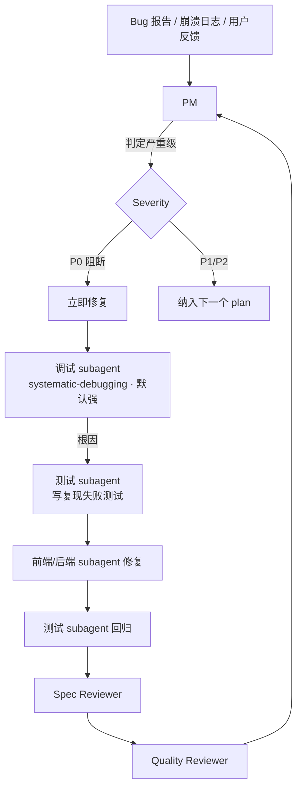
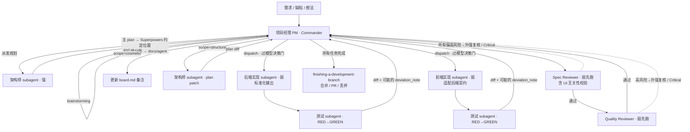

# Agent Team 规范(基于 Superpowers) 弃用

> 项目:基于大模型的翻译软件(Rust + Tauri 2)
> 编排框架:Claude Code + Superpowers 插件
> 版本:v2.4

---

## 1. 核心原则

1. **单一指挥官**:整个 Agent Team 只有一个 Commander(主编排器),由**项目经理(PM)担任,即用户本人(主规划者)**。
2. **Subagent 一次性、上下文隔离**:除 PM 外,所有角色都是 Superpowers 意义上的 fresh subagent。每个 subagent 只拿到完成其任务所需的最小输入,彼此**互不感知**,任务结束即销毁。
3. **强制 TDD**:所有实现走 RED → GREEN → REFACTOR。
4. **两阶段 Review**:Spec 合规 → 代码质量,Critical 问题阻断主流程。
5. **契约先行**:前后端可能同时接触的接口、类型、配置,一律先由架构师定义为契约,实现团队只读消费。
6. **PM 是唯一的信息中枢**:subagent 之间禁止直接通信,所有信息交换经由 PM 及其管理的文档。
7. **文档三分,且不侵占 Superpowers 产物**:Plan(该做什么)、Board(做到哪了)、Locks(谁在改什么)分别由架构师、PM、PM 独占写权限;Superpowers 自身会产出的文档(spec、主 plan)一律**遵循 Superpowers 框架自身的约定位置与命名,本规范不指定其路径**;仅本规范额外发明的产物进 `docs/agent/`(见 §10.1)。
8. **后端优先、前端适配**:后端是长期资产,前端是可替换的表达层(当前 Tauri 2 UI,未来可能替换)。后端始终输出标准化、规范化、UI 无关的内容;前端负责适配后端契约,而非后端为前端定制。所有职责划分、契约设计、灰色地带判定都遵循此原则。
9. **模型强弱决策门**:调度任何 subagent 前必须过"强弱模型决策门"。默认弱模型;禁止因主会话用强模型就让 subagent 继承强模型;只有通过升级判断后才显式指定强模型(见 §5.6)。

---

## 2. 团队结构

| 层级 | 角色 | 身份 | 上下文 | 默认模型档位 | 主要 Skill |
|---|---|---|---|---|---|
| L0 | 项目经理(PM,即用户) | 唯一 Commander | 长上下文 | 主会话档 | `brainstorming`、任务派发、`finishing-a-development-branch` |
| L1 | 架构师 | Planner subagent | 一次性 | 强(把关层) | `writing-plans` |
| L2 | 后端团队 | Implementer subagent(Rust 核) | 一次性 | 弱 | `subagent-driven-development` + `test-driven-development` |
| L2 | 前端团队 | Implementer subagent(Tauri UI) | 一次性 | 弱 | `subagent-driven-development` + `test-driven-development` |
| L2 | 测试团队 | Test subagent | 一次性 | 弱 | `test-driven-development` |
| L3 | Review 团队 | Reviewer subagent | 一次性 | 弱先跑,按需升级 | `requesting-code-review` |
| — | Bug(不是团队) | 工作流分支 | —— | 调试默认强,详见 §6 | `systematic-debugging` + 上述链路 |

### 2.1 Review 团队内部分工

Review 团队处于独立的 L3 层级,与实现和测试解耦,内部再分两个子角色(都属于 Reviewer,不新增 Commander):

- **Spec Reviewer**:比对架构师的主 plan,检查偏离、遗漏、超范围实现;**同时校验后端契约是否遵循核心原则 8(UI 无关、标准化)**。
- **Quality Reviewer**:Rust `unsafe` / 错误传播 / 异步取消;Tauri `capabilities/` 权限清单 / CSP / IPC schema;LLM 调用超时、重试、成本、prompt 注入防护;**后端代码中是否混入了 UI 语义**。

Review 必须与测试团队分离:测试团队参与 TDD 循环,与实现 subagent 在同一任务闭环内协作,无法客观评判自己刚配合产出的代码;Review 要以完整 plan + diff 为输入,上下文尺度与测试完全不同。

### 2.2 为什么没有"Bug 团队"

Bug 是**输入类型**不是**角色能力**。定位、修复、回归、审核这些能力现有团队已覆盖。Bug 单独走一条 **Triage 分支**(见 §6),由 PM 判定后复用既有 subagent。

---

## 3. 职责边界

### 项目经理(PM · 用户本人 · Commander)

- 与外部人对话,是**唯一**能接收自然语言需求的角色。
- 定稿 spec、审批 plan、派发任务、决定合并 / PR / 丢弃。
- 处理 Reviewer 抛出的 Critical 阻断。
- 维护物理工作环境(分支 / worktree,见 §8)。
- **维护任务看板** `docs/agent/board.md`。
- **维护文件锁** `docs/agent/locks.json`。
- **执行模型决策门**:每次 dispatch 前按 §5.6 判定并填写 subagent 的 `model_tier`。
- **偏差分诊**:接收 `deviation_note`,判定影响面,微小偏差自己在 board 备注,实质偏差转交架构师。
- **不写代码**、**不直接跑测试**、**不手动解 merge conflict**、**不修改 plan**。

### 架构师(默认强模型)

- 输入:PM 签字的 spec,或 PM 转来的 deviation_note。
- 输出:**主 plan(遵循 Superpowers 框架约定位置)** + 前端任务清单 + 后端任务清单(后两者进 `docs/agent/`,见 §4、§10.1)。
- 技术方案统一规划,**前端方案必须建立在后端契约之上,不允许"因为前端方便"而反向要求后端定制字段**。
- 独占契约文件的写权限(见 §5.1);**契约段写在主 plan 里**,不抽到 `docs/agent/`。
- **契约设计准则**:后端契约必须 UI 无关。所有字段、命名、结构、错误码假设"未来会有一个 Web 前端、一个 CLI、一个 iOS 客户端同时消费",禁止 Tauri 专属或前端渲染专属语义。
- **持续维护 plan**:PM 转来实质性偏差时产出 plan diff 并同步,标注受影响的下游任务 ID。
- 不参与实现、不参与 Review。

### 后端团队(默认弱模型)

- 每个任务一个 fresh subagent,只读该任务卡指定文件 + 主 plan 的契约段。
- 严格 TDD:先由测试 subagent 产出失败测试,再写最小实现。
- **产出必须 UI 无关**:不得出现 `display_*`、`render_*`、`formatted_for_ui_*` 字段;不得硬编码 UI 文案、颜色、图标、本地化字符串;不得依赖任何 Tauri 特定运行时假设(除 Tauri command 边界本身)。
- 完成后交出 diff 和测试结果给 PM,不直接呼叫 Reviewer。
- 不得修改契约文件;如需变更契约,停机回报 PM。
- **报告偏差**:实现与 plan 有出入时**不得自行修改 plan**,须附 `deviation_note`。
- 涉及 `unsafe`、并发原语设计、跨模块状态机时,由 PM 按 §5.6 升级模型档位。

### 前端团队(默认弱模型)

- 每个任务一个 fresh subagent,只读该任务卡指定文件 + 主 plan 的契约段。
- 严格 TDD。
- **前端是适配层**:负责把后端标准化数据转换为当前 UI(Tauri 2)所需的视觉表达。所有本地化、格式化、拼接、时间显示、脱敏展示由前端完成。
- **不得向后端提"为了前端方便,请后端返回 X"的需求**。若确需后端没有的原始数据,提 `deviation_note` 由架构师依 §5.5 判定。
- 完成后交出 diff 和测试结果给 PM。
- 不得修改契约文件。报告偏差机制同后端。
- 适配层性质决定其几乎永不升级模型档位。

### 测试团队(默认弱模型)

- 与实现 subagent 在同一任务闭环内协作:写 RED 测试 → 等实现 → 验证 GREEN。
- 负责单元 / 集成 / Tauri IPC 契约测试。
- **后端测试与前端测试严格分离**:后端测试**不得**依赖 UI 层,应能在无 Tauri 环境下独立运行(纯 `cargo test`)。这是核心原则 8 的可验证保证。
- **不做代码审查**,不评判风格。
- 仅当需设计复杂 property-based test 或 fuzzing 策略时升级模型档位。

### Review 团队(默认弱先跑)

- 由 PM 在实现 + 测试通过、所有 deviation 已消化后调起。
- 两阶段串行:Spec Reviewer 先跑,通过后 Quality Reviewer 才启动。
- 输出分级:`Critical`(阻断) / `Major`(需修复) / `Minor`(可选)。
- **后端 UI 无关性校验是 Spec Reviewer 的 Critical 项**。
- **模型档位遵循"审查先弱后强"**(§5.6):弱模型首轮审查,仅在高不确定性、跨模块影响、关键架构取舍、安全/性能风险、反复失败或验证成本明显高于复核成本时升级强模型复核。
- Critical 直接回退实现团队;Reviewer **不允许自己改代码或改 plan**。

---

## 4. 架构师产出的三段式 Plan

架构师完成 `writing-plans` 后必须产出**三份文档**,禁止合并为单文件,也禁止只有分册没有总纲。**存放位置遵循核心原则 7**:

| 文件 | 内容 | 存放位置 | 命名 | 读者 |
|---|---|---|---|---|
| 主 plan | 里程碑、任务 DAG、**后端契约(UI 无关)**、共享数据结构、验收标准 | **Superpowers 框架约定位置**(本规范不指定) | Superpowers 默认命名 | PM + 所有 subagent(只读契约段) |
| 前端任务清单 | 前端任务卡,每任务引用契约 ID,标注"如何把后端数据适配为 UI 表达" | `docs/agent/` | 主 plan 文件名去扩展名 + `-frontend` | PM + 前端 subagent |
| 后端任务清单 | 后端任务卡,每任务引用契约 ID,**明确禁止 UI 语义** | `docs/agent/` | 主 plan 文件名去扩展名 + `-backend` | PM + 后端 subagent |

**说明**:

- **spec 和主 plan 是 Superpowers 自身产物,遵循 Superpowers 框架约定的位置与命名,本规范不干预**,以便不使用 Agent Team、仅使用 Superpowers 的协作者能正常读取全部核心文档。
- **契约段写在主 plan 里**,分册通过引用契约 ID 消费,不复制契约内容。
- 分册命名以当前 Superpowers 版本主 plan 的实际文件名为基准派生,保证分册与主 plan 通过 slug 天然关联,不产生孤儿文件。
- 主 plan 只有架构师有写权限;两份分册也只有架构师有写权限——**因为分册是主 plan 的切片投影,承载跨侧依赖与边界信息,只有持全局视野的架构师能保证它与主 plan 一致、不漂移**。

每条任务卡的必要字段:

- `task_id`
- `owner`:`frontend` / `backend`(禁用 `both`,必须再拆)
- `files_to_write`:**显式声明将修改的文件路径清单**(用于 §5.2 的锁)
- `files_to_read`:允许读取的路径清单
- `contract_refs`:引用的契约 ID
- `depends_on`:前置任务 ID
- `can_parallel_with`:可与之并行的任务 ID
- `acceptance`:验收条件(含测试命令)
- `model_tier`:必填,`weak` / `mid` / `strong`,默认取角色默认档位(见 §2 表 / §5.6)
- `tier_rationale`:仅当档位偏离角色默认(升级或降级)时必填,写明原因与该模型的限定职责
- `review_stage`(仅 Review 类任务):`initial` / `escalated`
- `boundary_rationale`(涉及灰色地带时必填):按 §5.5 说明为何归给这一侧
- `deviation_note`(可选,subagent 完成时回填):`scope`(`cosmetic` / `structural`) + `affects`(受影响的其他 task_id)

---

## 5. 冲突、文档同步、职责划分与模型分配

### 5.1 契约文件(架构师独占写权限)

以下视为**契约层**,只有架构师有写权限,前后端 subagent 只读:

- `src-tauri/src/ipc/contract.rs` 或等价的 command / event 定义
- `shared/types/**`:跨端 DTO、错误码枚举
- `capabilities/**`:Tauri 2 权限清单(permissions / scopes)
- `tauri.conf.json`:仅窗口、打包、安全策略(CSP)等**非权限**配置
- 根 `Cargo.toml` workspace 段、`package.json` 公共脚本段

**契约设计硬约束(呼应核心原则 8)**:

- 字段命名一律领域语言,禁止 UI 语言。可有 `source_lang` / `target_lang` / `translated_at`,不可有 `display_lang_label` / `formatted_time`。
- 错误契约采用 `{code, params}` 结构化形式,**不返回**已本地化文案。
- 时间一律 ISO 8601 或 Unix 时间戳,不返回"3 分钟前"。
- 数字、货币、百分比返回原始数值 + 单位标识,不返回已格式化字符串。
- 敏感字段(API Key、Token)在契约层就已脱敏或不下发,不依赖前端遮盖。
- Tauri command 层作为契约的**传输适配**存在,不承载业务逻辑;未来更换前端时可被 HTTP / gRPC / 其他 IPC 替换,契约本身不变。

前后端 subagent 若需修改契约 → **立即停止**,回报 PM,PM 调架构师产出契约 diff 后重新 dispatch。

### 5.2 任务级文件锁(fail-fast)

PM 在 dispatch 前维护 `docs/agent/locks.json`:

```json
{
  "active": [
    {
      "task_id": "T-042",
      "owner": "backend",
      "files": ["src-tauri/src/translator/mod.rs"],
      "started_at": "2026-07-08T10:00:00Z"
    }
  ]
}
```

**PM 的 dispatch 前置检查**:

1. 读取任务卡 `files_to_write`。
2. 与 `locks.json.active[*].files` 求交集。
3. 有交集 → 不派发,进 pending 队列。
4. 无交集 → 写锁后再 dispatch。

**Subagent 运行时义务**:只能改自己 `files_to_write` 列出的文件;需改额外文件则停机回报;任务结束由 PM 释放锁。

### 5.3 兜底:合并冲突升级为 P1 Bug

前两层失效、PM 整合 diff 或合并出现 git conflict 时:PM **不自己手动解冲突**,将其作为 **P1 Bug** 走 §6,由架构师判定冲突归属(通常意味契约切分不够干净)。

### 5.4 文档同步的双通道机制

| 文档 | 内容性质 | 存放位置 | 写权限 |
|---|---|---|---|
| 主 plan | 该做什么(规划事实) | **Superpowers 框架约定位置** | 架构师独占 |
| 前端 / 后端任务清单 | 该做什么(分册) | `docs/agent/` | 架构师独占 |
| `docs/agent/board.md` | 做到哪了(编排事实) | `docs/agent/` | PM 独占 |
| `docs/agent/locks.json` | 谁在改哪些文件 | `docs/agent/` | PM 独占 |

**任务状态同步(PM 负责)**:

- Dispatch → `board.md` 写 `T-042: in-progress`。
- 返回 diff → `board.md` 更新 `awaiting-review`。
- Reviewer 通过 → `done`,释放锁。
- Critical 阻断 → `blocked`,附回退原因。

**规划偏差同步(架构师负责,PM 分诊)**:

1. 实现 subagent 返回时附 `deviation_note`。
2. PM 判定:`scope: cosmetic` 且 `affects: []` → PM 在 `board.md` 备注,plan 不动;其他情况 → PM 派发架构师 patch 任务(输入 deviation_note + 相关 plan 片段),输出 plan diff,PM 审核落盘。**架构师改的是 Superpowers 位置的主 plan 和/或 `docs/agent/` 的分册,各按其归属**。
3. plan diff 影响已 dispatch 未完成任务 → PM 撤回重派。
4. plan diff 触及契约(§5.1)→ 走契约变更流程,强制串行。

**禁止**:任何非架构师角色修改 plan(主 plan 或分册);任何非 PM 角色修改 board 或 locks。

### 5.5 前后端职责划分规则

灰色地带划分遵循**核心原则 8**。判定顺序:

**主问题**:这段处理的**输出**,除了当前 Tauri UI,假设换成其他前端(Web / CLI / 移动端)是否仍需要?需要 → **后端**(作为契约输出);仅为当前 UI 视觉服务 → **前端**。

**辅助问题**(主问题模糊时):

1. 结果随用户 locale / 时区 / OS / 视口变化? → 是 → 前端。
2. 结果被业务逻辑、审计、外部系统消费? → 是 → 后端。
3. 涉及安全边界(权限、脱敏、prompt 注入)? → 是 → 后端。

**速查表(翻译软件常见场景)**:

| 场景 | 归属 | 依据 |
|---|---|---|
| 姓+名拼显示名、Markdown 渲染、相对时间、数字格式化、货币符号、快捷键提示 | 前端 | 表达层,locale / OS 敏感 |
| 术语表命中高亮、翻译历史分组标签("今天/昨天") | 前端 | 表达型 |
| 错误提示文案本地化 | 后端出 `{code, params}` + 前端出文案 | 结构化 + 本地化分工 |
| 权限决定的字段可见性、敏感字段脱敏、API Key 隐藏 | 后端 | 安全边界,"隐藏 ≠ 未下发" |
| 分页 / 排序 / 过滤 / 复杂计算 / 汇率换算 | 后端 | 数据量、一致性、审计 |
| 表单校验 | 双端:前端即时反馈,后端强校验 | 前端不能替代后端 |
| 大模型 prompt 组装、注入清洗、限流 | 后端 | 安全 + 成本 |
| 大模型输出的流式 chunk 渲染 | 前端 | 表达层 |
| 长度限制、字符数统计 | 双端:前端提示,后端强校验 | 同表单 |
| 翻译历史"未读/已读"状态 | 后端 | 跨设备同步的业务事实 |

**无法判定或跨界的兜底**:subagent **一律不得自行决定跨界归属**;架构师在规划期识别灰色字段并填 `boundary_rationale`;架构师也拿不准的在主 plan 的 `open-questions` 段落列出交 PM 决策;执行中遇到 plan 未覆盖的跨界问题 → 停机 → `deviation_note: scope=structural` → PM 转架构师 → 按原则 8 补契约或 boundary_rationale → 重派。

### 5.6 模型强弱决策门

调度任何 subagent 前必须过此门。默认弱模型;禁止因主会话用强模型就让 subagent 继承强模型;只有通过升级判断后才显式指定强模型。

**决策门必填项**(在任务卡 `model_tier` / `tier_rationale` 及编排说明中体现):任务类型、风险等级、是否可用测试或人工审查验证、弱模型是否足够、是否触发强模型升级条件。

**默认弱模型**:开发、测试、文档、检索、脚本化验证、规格草案、普通规格审查、普通代码质量审查、重复性检查等默认弱模型。若工具需显式模型参数,必须显式填弱模型;若工具默认继承主会话模型,必须覆盖默认值,避免无意使用强模型。

**审查先弱后强**:规格审查和代码质量审查默认先由弱模型完成;只有弱模型输出显示高不确定性、跨模块影响、关键架构取舍、安全/性能风险、反复失败或验证成本明显高于复核成本时,才升级强模型复核。

**强模型升级记录**:调用强模型前必须在 `tier_rationale` 写明升级原因和强模型的限定职责(例如"仅复核弱模型发现的高风险点""仅判断架构取舍"),不得把常规实现、常规审查或批量重复任务直接交给强模型。

**通用分级原则**:先判断任务需要"执行层模型"还是"把关层模型",再映射到当前工具可用的同级模型;新增其他模型供应方时,按其公开/本地约定的能力梯队归入弱、中、强三档,不为单个工具写特殊规则。

**当前常用梯队**:Claude Code 按 `fable > opus > sonnet > haiku` 分级;Codex 按当前工具/团队约定的 `GPT 5.5 > GPT 5.4` 分级。若外部工具实际可用模型名称变化,以该工具当前可用的同级最高/次高级模型替代,不改变强弱分配原则。

**本规范角色 × 档位默认映射**:

| 角色 | 默认档位 | 升级 / 降级条件 |
|---|---|---|
| PM(主会话) | 主会话档 | —— |
| 架构师 | 强(把关层) | 仅常规 CRUD 拆解、无契约新增/调整时可降中 |
| 后端实现 | 弱 | 涉及 `unsafe`、并发原语、跨模块状态机时升中/强 |
| 前端实现 | 弱 | 几乎不升级 |
| 测试 | 弱 | 复杂 property-based / fuzzing 策略时升级 |
| Spec Reviewer | 弱先跑 | 高不确定性、跨模块、契约级偏差时升强复核 |
| Quality Reviewer | 弱先跑 | `unsafe`、Tauri IPC 安全边界、prompt 注入面、性能关键路径时升强 |
| 调试(P0/P1) | 强(把关层) | 明显小 bug(typo / 空指针)时降弱 |
| Plan patch | 跟随原架构师档位 | —— |

---

## 6. Bug 处理流程(Triage 分支)



**规则**:

- P0(数据丢失 / 崩溃 / 安全):立刻起 hotfix,跳过架构师,PM 直接派发。
- P1/P2:架构师在下一轮 plan 排期,走标准流程。
- 任何 bug 修复**必须先有失败的复现测试**,否则不得进入实现阶段。
- **修复优先在后端修**:同一 bug 前后端都能修时,优先在后端把数据规范化,而非前端打补丁。
- 调试 subagent 默认强模型(根因分析属高风险决策);明显小 bug 按 §5.6 降弱。

---

## 7. 标准任务流转



**并行与串行的边界**:

| 层面 | 规则 |
|---|---|
| Subagent 执行 | 允许并行,条件是 `files_to_write` 无交集且 `depends_on` 已满足 |
| Diff 落盘 / commit | 由 PM 串行执行,保证提交历史线性 |
| Reviewer 阻断决策 | 串行,Critical 立即中断后续步骤 |
| 契约变更 / Plan patch | 强制串行 |

**Subagent 视角**:任何 subagent 只看到自己那份任务卡 + 允许读的文件 + 契约段,**感知不到其他 subagent 的存在**,也感知不到当前有几个任务在并行。并行是 PM 层面的调度决策。

---

## 8. PM 的物理工作环境(worktree 说明)

Worktree 是 **PM 自己的物理工作台层面** 的事,与 subagent 无关:

- **一份 plan = 一个分支**。所有角色的产出都以 commit 形式落到这同一个分支。
- PM 可选:主仓库直接 `git checkout -b feature/xxx` 就地工作,或 `git worktree add ../repo-xxx feature/xxx` 检出到另一目录。二者对本规范**完全等价**。
- 仅当**同时并行推进多份互不依赖的 plan** 时,才为每份 plan 各起一个 worktree。单人 PM 通常同时只推一份 plan,一个分支就够。

**subagent 不关心 worktree 是否存在**。

---

## 9. Skill 触发对照表

| 阶段 | 触发者 | Skill | 产物 / 位置 |
|---|---|---|---|
| 需求澄清 | PM | `brainstorming` | `spec`(Superpowers 框架约定位置) |
| 分支准备 | PM | `using-git-worktrees`(可选) | 干净分支 / worktree |
| 规划 | 架构师 | `writing-plans` | 主 plan(Superpowers 约定位置) + 前后端分册(`docs/agent/`) |
| 派发 | PM | `subagent-driven-development` / `dispatching-parallel-agents` | 逐任务 dispatch(含模型决策门) |
| 实现 | 后端 / 前端 | `test-driven-development` | diff + 绿测 + 可能的 deviation_note |
| Plan 修订 | 架构师 | `writing-plans`(增量) | plan diff(按归属落盘) |
| 审核 | Reviewer | `requesting-code-review` | review 报告(`docs/agent/`) |
| 调试 | 调试 subagent | `systematic-debugging` | 根因分析 |
| 收尾 | PM | `finishing-a-development-branch` | PR / 合并 |

---

## 10. 通信契约

- **PM ↔ subagent** 之间只通过:`spec` / 主 plan / 前后端分册 / 任务卡 / diff / test output / `deviation_note` / `review.md` / `board.md`。
- Subagent 之间**禁止直接对话**;如需信息,经由 PM 转交或写入共享文档。
- 协作文档存放遵循 §10.1 的目录归属规则。

### 10.1 `docs/agent/` 与 Superpowers 框架产物的关系

本规范额外发明的产物与 Superpowers 自身产物严格分层存放,互不侵占:

| 归属 | 维护方 | 内容 | 位置 | 生命周期 |
|---|---|---|---|---|
| **框架层** | Superpowers 插件 | SKILL.md、skill 使用记录、框架配置、**spec、主 plan** | **Superpowers 框架约定位置**(由插件/技能自行决定,本规范不覆盖) | 跟随 Superpowers 版本 |
| **项目层** | 本规范 | 前后端任务清单、board、locks、任务卡衍生、review 报告、deviation 记录 | `docs/agent/` | 跟随本项目分支 |

**规则**:

1. **Superpowers 插件相关技能产生的文件,存放位置一律遵循 Superpowers 框架约定,本规范不指定路径、不干预、不重定向**。架构师 subagent 应让这些 skill(spec、主 plan 等)按其默认行为落盘,不得强制改到 `docs/agent/`。仅用 Superpowers、不用 Agent Team 的协作者据此即可获得全部核心文档,不会"丢文件"。
2. 仅本规范额外发明、Superpowers 原本不存在的产物(分册、board、locks、review、deviation)才进 `docs/agent/`。
3. 分册命名派生自主 plan 文件名(去扩展名 + `-frontend` / `-backend`),向 Superpowers 命名风格看齐,与主 plan 通过 slug 天然关联。
4. **两侧不互相引用**:`docs/agent/` 内容禁止依赖 Superpowers 产物的具体路径/文件名(SKILL.md 触发除外);Superpowers 产物也不应引用本项目 board / locks。保证更换 Superpowers 版本或替换编排框架时 `docs/agent/` 可原样保留。
5. **提交策略**:`docs/agent/` 必须入库(记录了实际协作历史);Superpowers 产物入库策略跟随其官方建议,避免误提交 skill 缓存。

---

## 11. 反模式(禁止)

1. ❌ 把架构师也设为 Commander → 上下文分裂。
2. ❌ 把审核并入测试团队 → 失去客观裁判。
3. ❌ 新增独立 Bug 团队 → 能力重复、职责错位。
4. ❌ Reviewer 直接改代码或改 plan → 越权,破坏 TDD 闭环与规划基准。
5. ❌ 跳过 RED 测试直接修 bug → 缺陷会复发。
6. ❌ 在同一个 subagent 里连续跑多个任务 → context rot。
7. ❌ 把 plan 合成一份大文件让前后端共用 → subagent 上下文被污染。
8. ❌ 前后端 subagent 自行修改契约文件 → 契约漂移。
9. ❌ 只做事后文件修改记录、不做派发前锁检查 → 冲突已发生才发现。
10. ❌ PM 手工解 merge conflict → 绕过 Review。
11. ❌ 让 subagent 感知 worktree / 其他并行 subagent → 破坏上下文隔离。
12. ❌ 一个任务一个 worktree → 混淆物理环境与逻辑角色。
13. ❌ 实现 subagent 自行修改 plan → plan 漂移,Reviewer 失去基准。
14. ❌ 把任务状态直接写回 plan → 规划事实与编排事实混淆。
15. ❌ 后端字段命名或结构携带 UI 语义(`display_*`、`formatted_*`、已本地化文案) → 违反核心原则 8。
16. ❌ 后端返回相对时间、已格式化数字、已本地化错误文案 → 应返回结构化原始数据由前端适配。
17. ❌ 前端 subagent 反向要求后端为前端定制字段 → 应由前端在适配层处理,或走 deviation 由架构师依 §5.5 判定。
18. ❌ 后端代码依赖 Tauri 特定运行时(除 command 传输边界外) → 未来更换 UI 时无法平移。
19. ❌ 前后端 subagent 自行决定灰色地带归属 → 应停机走 deviation_note 交架构师。
20. ❌ 把 spec / 主 plan 搬进 `docs/agent/`,或强制重定向 Superpowers 技能的默认落盘位置 → 仅用 Superpowers 的协作者会丢失核心文档。
21. ❌ `docs/agent/` 文档硬依赖 Superpowers 产物的具体路径 → 破坏可迁移性。
22. ❌ 不过模型决策门直接派发 subagent,或因主会话用强模型就让 subagent 继承强模型 → 违反核心原则 9。
23. ❌ 审查一上来就用强模型,或把常规实现/批量重复任务交给强模型 → 违反"审查先弱后强"与升级记录要求。
24. ❌ 在 `tauri.conf.json` 里找 / 写 `allowlist` 权限字段 → Tauri 2 权限只在 `capabilities/`,该字段不存在。

---

## 12. 扩展预留

- 当项目膨胀到需要拆分子系统(如翻译内核、插件市场、Tauri Shell 三者解耦)时,可为每个子系统起独立 Superpowers 实例,各自一位 PM Commander,通过 git worktree 并行推进。此时才允许"多个指挥官"。当前规模下**保持单 Commander**。
- 当未来前端从 Tauri 切换到其他技术栈(Web、Electron、移动端)时,理论上只需重写前端任务清单对应的实现,后端契约与实现应保持不变。**这一可迁移性是核心原则 8 的验证标准**,也是 Review 团队需长期把关的目标。
- 当外部工具的可用模型名称或梯队发生变化时,按核心原则 9 的通用分级原则,将新模型归入弱/中/强三档,不为单个工具写特殊规则,不改变强弱分配逻辑。
